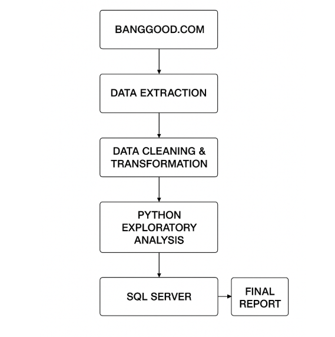

🚀 What This ETL Pipeline Does

1️⃣ Extract

Uses Selenium WebDriver to open a webpage

Waits for page elements to load

Scrapes dynamic content

Parses HTML with BeautifulSoup

2️⃣ Transform

Stores raw data into a Pandas DataFrame

Cleans missing or invalid values

Normalizes and formats all extracted fields

3️⃣ Load

Loads the cleaned dataset into:

SQL Server (pyodbc)

Automatically creates the table if it doesn't exist

